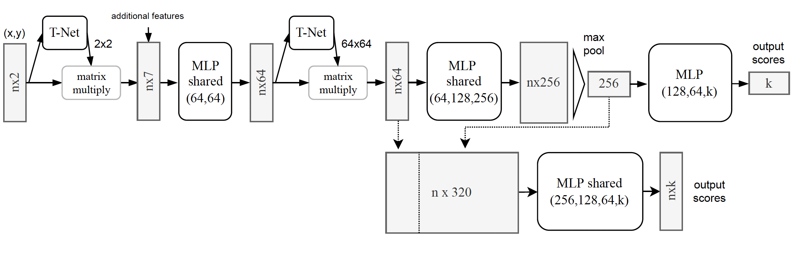

# Object Segmentation of Cluttered Airborne LiDAR Point Clouds
Created by [Mariona Carós](https://www.linkedin.com/in/marionacaros/), [Santi Seguí](https://ssegui.github.io/) and [Jordi Vitrià](https://algorismes.github.io/) from University of Barcelona and [Ariadna Just](https://www.linkedin.com/in/ariadna-just-0a667559/?originalSubdomain=es) from [Cartographic Institute of Catalonia](https://www.icgc.cat/es)

## Introduction
This work is based on our [arXiv report](https://arxiv.org/abs/2210.16081), proceedings of the 24th International Conference of the Catalan Association for Artificial Intelligence (CCIA 2022)

Airborne topographic LiDAR is an active remote sensing technology that emits near-infrared light to map objects on the Earth’s surface. Derived products of LiDAR are suitable to service a wide range of applications because of their rich three-dimensional spatial information and their capacity to obtain multiple returns. However, processing point cloud data still requires a large effort in manual edit- ing. Certain human-made objects are difficult to detect because of their variety of shapes, irregularly-distributed point clouds, and a low number of class samples. In this work, we propose an end-to-end deep learning framework to automatize the detection and segmentation of objects defined by an arbitrary number of LiDAR points surrounded by clutter. Our method is based on a light version of [PointNet](http://stanford.edu/~rqi/pointnet/) that achieves good performance on both object recognition and segmentation tasks. The results are tested against manually delineated power transmission towers and show promising accuracy.
 
**Pipeline for 3D segmentation on LiDAR data with Deep Learning:**


## Citation
If you find our work useful, please consider citing:
```
@article{caros2022object,
  title={Object Segmentation of Cluttered Airborne LiDAR Point Clouds},
  author={Caros, Mariona and Just, Ariadna and Segui, Santi and Vitria, Jordi},
  journal={arXiv preprint arXiv:2210.16081},
  year={2022}
}
```

## Installation
The code has been tested with Python 3.7, [Pytorch](https://pytorch.org/) v1.8, CUDA 11.6  on Ubuntu 20.04. <br />
You may also need to install ```pdal``` library to transform height above sea (HAS) data into height above ground (HAG).<br />
```
pip install pdal
```

## Preprocessing pipeline


## Usage
Execute the following commands from the main directory.

### Preprocessing
First, execute:
```
python data_proc/1_get_windows.py --LAS_files_path path/LAS_files/here --sel_class $selected_class --min_p 20
```
This function splits our dataset into windows of a fixed size with and without our target object. <br />
First x,y,z of points labeled as our target object are obtained. <br />
Then, objects are segmented and the center of each object is stored, objects with less than ```min_p``` points are discarded. <br />
Finally, two versions of the same point cloud window are stored. A first one with a tower and a second one without tower. <br />
Point cloud cubes not containing the target object are stored as well.  <br />

Then, use PDAL library to get HAG data by executing the following code for all .LAS files: <br />
```
pdal translate $input_file $output_file hag_nn --writers.las.extra_dims="HeightAboveGround=float32"
```

Finally, run:
```
python data_proc/2_preprocessing.py --in_path path/input_files --out_path path/output_proc_files
```
This function first removes ground and points above 100 meters and then stores a sampled version using the constrained sampling explained in the paper. <br />


### Neural Network for classification and segmentation of objects



To train models use:<br />
```
python pointNet/train_classification.py  $data_path --path_list_files $list_files_split_path  --batch_size 32 --epochs 50 --learning_rate 0.001 --weighing_method EFS --number_of_points 2048 --number_of_workers 4 --c_sample True
```

```
python pointNet/train_segmentation.py $data_path --path_list_files $list_files_split_path  --batch_size 32 --epochs 50 --learning_rate 0.001 --weighing_method EFS --number_of_points 2048 --number_of_workers 4 --c_sample True
```
For model inference use:<br />
```
python pointNet/test_classification.py /dades/LIDAR/towers_detection/datasets pointNet/results/ --weighing_method EFS --number_of_points 2048 --number_of_workers 0 --model_checkpoint $checkpoint_path
```
```
python pointNet/test_segmentation.py /dades/LIDAR/towers_detection/datasets pointNet/results/ --number_of_points 2048 --number_of_workers 0 --model_checkpoint
```
## Results


## License
Our code is released under MIT License (see LICENSE file for details).
