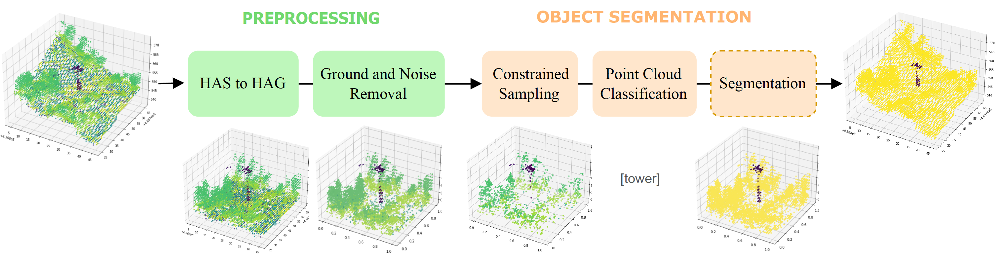
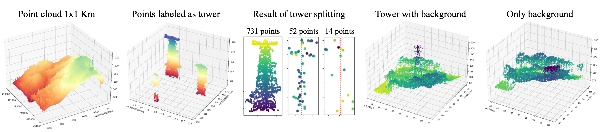
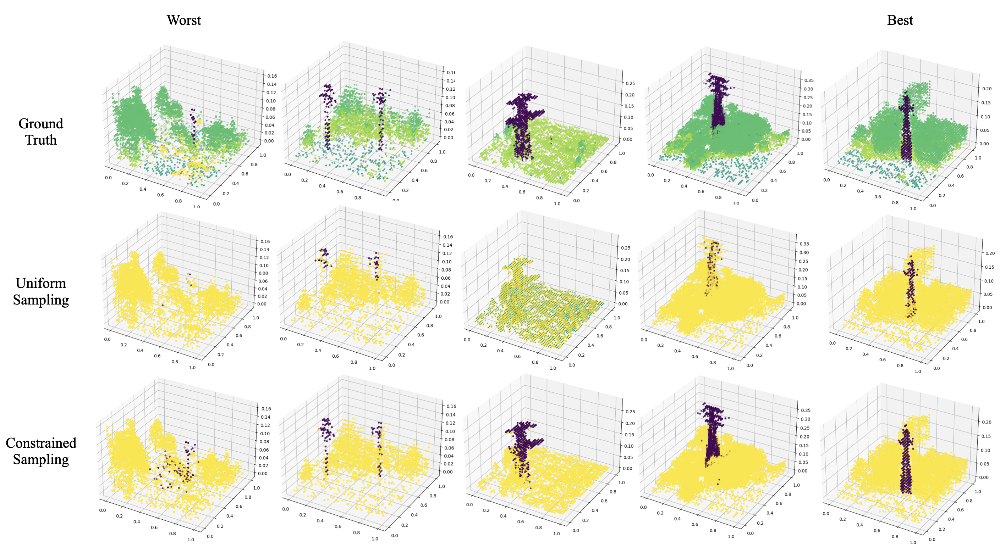

# Object Segmentation of Cluttered Airborne LiDAR Point Clouds
3D segmentation on LiDAR data with Deep Learning



## Installation
The code has been tested with Python 3.7, [Pytorch](https://pytorch.org/) v1.8, CUDA 11.6  on Ubuntu 20.04. <br />
You may also need to install ```pdal``` library to transform height above sea (HAS) data into height above ground (HAG).<br />
```
pip install pdal
```

## Usage
Execute the following commands from the main directory.

### Preprocessing


```
python data_proc/1_get_windows.py --LAS_files_path path/LAS_files/here --sel_class $selected_class --min_p 20
```
This function splits our dataset into windows of a fixed size with and without our target object <br />
First x,y,z of points labeled as our target object are obtained. <br />
Then, objects are segmented and the center of each object is stored, objects with less than ```min_p``` points are discarded. <br />
Finally, two versions of the same coordinates are stored. A first one with a tower and a second one with without tower. <br />

```bash compute_pdal_bash.sh``` or execute the following code for all .LAS files
```pdal translate $input_file $output_file hag_nn --writers.las.extra_dims="HeightAboveGround=float32"```

```
python data_proc/2_preprocessing.py 
```
### Object Segmentation

## Results


## License
Our code is released under MIT License (see LICENSE file for details).
